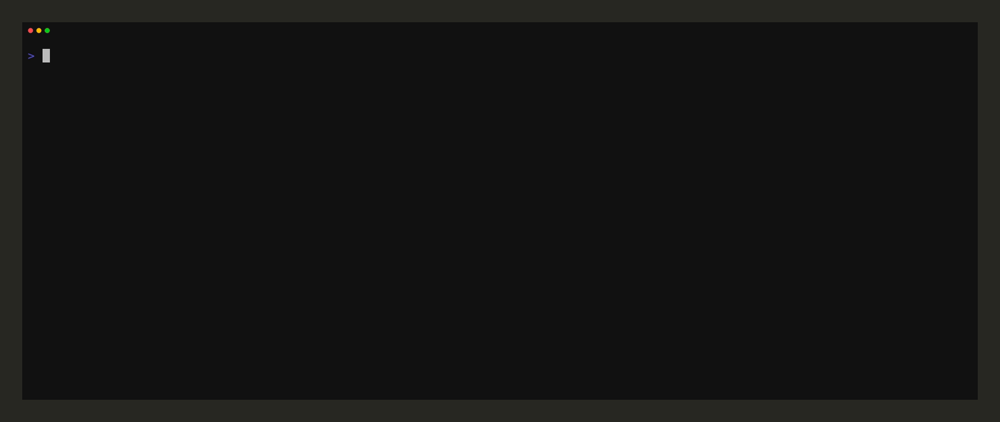

# repoctx

[](https://go.dev/doc/install)
[](https://github.com/SrIruma/repoctx/actions)
[](https://github.com/SrIruma/repoctx/releases)
[](https://github.com/SrIruma/repoctx/releases)
[](https://goreportcard.com/report/github.com/SrIruma/repoctx)
[](LICENSE)

repoctx keeps your AI coding-agent context files (`AGENTS.md`, `CLAUDE.md`) truthful. It scans a repository, extracts facts from the real code — build/test commands, module structure, dependencies — and uses them to regenerate the factual sections of your context files, preserving anything a human wrote.



## Why

Context files rot. A README mentions a `make release` target that no longer exists; `AGENTS.md` lists `backend/` as a path that was renamed months ago. Agents read those files and act on stale information. repoctx is the source of truth for everything that can be derived from the repository itself.

## Install

```sh
go install github.com/SrIruma/repoctx/cmd/repoctx@latest
```

Or build from source:

```sh
make build   # -> bin/repoctx
make install # -> $GOBIN/repoctx
```

## Commands

| Command | Description |
|---|---|
| `repoctx info [dir]` | Detect manifests and extract facts from a repository. Manifests that fail to parse are kept in the report with a `!` warning (and an `errors` field in `--json`). |
| `repoctx generate [dir]` | Regenerate the code-derived sections of a context file (`AGENTS.md` by default, or the `files` from `repoctx.toml` / `--file`) between repoctx markers. `--dry-run` previews what would change without writing. |
| `repoctx audit [dir]` | Detect context rot: stale paths and ghost commands, with a health score. `--check` exits non-zero on failure for CI gating. |
| `repoctx workflow [file ...]` | Print a paste-ready block telling agents how to keep the context file truthful. |

Run `repoctx <command> --help` for full usage. `info`, `generate` and `audit`
share the same scan tuning flags: `--max-depth` limits how far repoctx
descends, `--skip-dirs` (repeatable) adds directories to skip on top of the
built-ins, and `--config` points at an explicit `repoctx.toml`. Exit codes and
the `--json` output schemas are part of the [contract](docs/contract.md).

## Configuration

repoctx reads an optional `repoctx.toml` from the target directory. Values
can come from three layers, in precedence order: command-line flags, then the
config file, then built-in defaults.

```toml
# repoctx.toml
max_depth = 4               # how deep the scanner descends
skip_dirs = ["third_party"] # extra directories to skip (built-ins always apply)
files = ["AGENTS.md", "CLAUDE.md"]  # default context files for generate
```

- `--max-depth` and `--skip-dirs` on the command line win over the config
  file; the built-in skip list (`.git`, `node_modules`, `vendor`, …) is
  always preserved.
- `generate` uses `files` from the config when no `--file` is given
  (otherwise `AGENTS.md`).
- `--config <path>` reads the config from a specific location instead of
  `<dir>/repoctx.toml`.

## Workspaces

Workspace (monorepo) layouts — npm/pnpm workspaces, cargo workspaces —
are scanned naturally: every manifest in the tree is detected, including the
workspace root and each member package. Commands are attributed per manifest:

- the root `package.json` contributes its own scripts, and each member
  package contributes its own;
- the same command string from different manifests (e.g. `npm run test` at
  the root and inside `packages/app`) is intentional and disambiguated by the
  Source column of the Commands table;
- a given `(command, source)` row is never emitted twice.

Cargo has one nuance: a virtual workspace root (a `Cargo.toml` with
`[workspace]` and no `[package]`) exposes the commands that operate on the
whole workspace — `cargo build`, `cargo test`, `cargo fmt --check`,
`cargo clippy` — but not `cargo run`, which has no default binary to run.
Member crates keep the full command set.

## Demo

Inspect what a monorepo looks like to repoctx:

```console
$ repoctx info tests/fixtures/scanner/mono
Detected manifests in /path/to/scanner/mono:
  backend/go.mod               go         Go                     commands: [build, test, vet, fmt]  (1 deps)
  package.json                 npm        JavaScript/TypeScript  commands: [build, test]  (0 deps)
  tools/rust/Cargo.toml        cargo      Rust                   commands: [build, test, run, fmt, clippy]  (0 deps)
```

Audit a context file and get a health score:

```console
$ repoctx audit tests/fixtures/audit/healthy
PASS  /path/to/audit/healthy/AGENTS.md  score 100/100
  ok  commands: 3 commands claimed
  ok  paths: all referenced paths exist
```

## Use in CI

Gate merges on context truth. `--check` exits non-zero when any audited file
fails, so a job can block a pull request when `AGENTS.md` / `CLAUDE.md` drift
from the code:

```yaml
# .github/workflows/ci.yml
- run: repoctx audit . --check
```

It composes with `--json` for machine-readable failures:

```yaml
- run: repoctx audit . --check --json
```

## How it works

1. **Scan** — repoctx walks the repository (skipping `node_modules`, `.git`, build output, …) and detects manifests: `package.json`, `Cargo.toml`, `go.mod`, `pyproject.toml`, `Makefile`, `CMakeLists.txt`, `Gemfile`, `composer.json`, `pom.xml`, `build.gradle`, `meson.build`.
2. **Extract** — each detected manifest is read by an adapter that turns it into facts: available commands and dependencies.
3. **Generate** — the facts are written between `<!-- repoctx:start -->` / `<!-- repoctx:end -->` markers. Anything outside the markers — your prose, conventions, warnings — is left untouched.
4. **Audit** — checks the claims in your context files against the current state of the code and scores the drift.

## Supported manifests

Every ecosystem detected by the scanner has a first-class adapter — nothing is
"adapter pending" anymore.

| Manifest | Language | Commands | Dependencies |
|---|---|---|---|
| `go.mod` | Go | `go build ./...`, `go test ./...`, `go vet ./...`, `gofmt -l .` | Go modules |
| `package.json` | JavaScript/TypeScript | npm scripts (`npm run build`, …) | npm packages |
| `Cargo.toml` | Rust | `cargo build`, `cargo test`, `cargo run`, `cargo fmt --check`, `cargo clippy` | crates |
| `pyproject.toml` | Python | `pytest`, `ruff check .` | Python packages |
| `Makefile` | Generic (Make) | make targets | — |
| `CMakeLists.txt` | C/C++ | `cmake --build` targets | libraries |
| `meson.build` | C/C++ | `meson setup`, `meson compile`, `meson test` | libraries |
| `Gemfile` | Ruby | `bundle exec …` | gems |
| `composer.json` | PHP | `composer run …` | composer packages |
| `pom.xml` | Java (Maven) | Maven targets | artifacts |
| `build.gradle` | Gradle | Gradle targets | artifacts |

## Markers

```markdown
<!-- repoctx:start -->
| Command | Source |
|---|---|
| `make test` | Run the test suite |
<!-- repoctx:end -->
```

`repoctx generate` rewrites only the content between the markers. Files without markers are never written.

## Development

```sh
make test      # go test ./...
make build     # bin/repoctx
make install   # $GOBIN/repoctx
make release VERSION=v1.0.0   # dist/repoctx_linux_amd64, repoctx_linux_arm64, repoctx_windows_amd64.exe + SHA256SUMS.txt
```

## Community

- [Contributing](CONTRIBUTING.md) — how to set up, branch, commit, and test.
- [Changelog](CHANGELOG.md) — release history.
- [Contract](docs/contract.md) — exit codes, JSON schemas and contract flags.
- [Examples](docs/examples.md) — verified usage in every case (generated).
- [Migration](docs/migration.md) — what changes between 0.x and 1.0.0.
- [Code of Conduct](CODE_OF_CONDUCT.md) — community guidelines.
- [Security](SECURITY.md) — how to report a vulnerability.
- [Issues](https://github.com/SrIruma/repoctx/issues) — report bugs and request features.

## License

[MIT](LICENSE)
